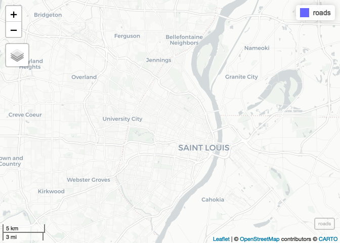

Meeting Examples - Completed
================
Christopher Prener, Ph.D.
(March 15, 2021)

``` r
knitr::opts_chunk$set(cache = FALSE)
```

## Introduction

This notebook reviews projections from last week and introduces skills
for joins in `R`.

## Dependencies

This notebook requires a number of different packages:

``` r
# tidyverse packages
library(dplyr)
```

    ## 
    ## Attaching package: 'dplyr'

    ## The following objects are masked from 'package:stats':
    ## 
    ##     filter, lag

    ## The following objects are masked from 'package:base':
    ## 
    ##     intersect, setdiff, setequal, union

``` r
library(ggplot2)
library(readr)

# spatial packages
library(mapview)
```

    ## GDAL version >= 3.1.0 | setting mapviewOptions(fgb = TRUE)

``` r
library(sf)
```

    ## Linking to GEOS 3.8.1, GDAL 3.1.4, PROJ 6.3.1

``` r
library(tigris)
```

    ## To enable 
    ## caching of data, set `options(tigris_use_cache = TRUE)` in your R script or .Rprofile.

``` r
# other packages
library(here)
```

    ## here() starts at /Users/chris/GitHub/slu-soc5650/content/module-3-intersect

``` r
library(viridis)
```

    ## Loading required package: viridisLite

## Load Data

This notebook requires a number of data sets:

``` r
# spatial data - census tracts with total area and population
pop <- st_read(here("data", "example-data", "STL_DEMOS_Pop", "STL_DEMOS_Pop.shp"),
               stringsAsFactors = FALSE)
```

    ## Reading layer `STL_DEMOS_POP' from data source `/Users/chris/GitHub/slu-soc5650/content/module-3-intersect/data/example-data/STL_DEMOS_POP/STL_DEMOS_POP.shp' using driver `ESRI Shapefile'
    ## Simple feature collection with 106 features and 5 fields
    ## geometry type:  POLYGON
    ## dimension:      XY
    ## bbox:           xmin: -90.32052 ymin: 38.53185 xmax: -90.16657 ymax: 38.77443
    ## geographic CRS: NAD83

``` r
# spatial data - north city 
north_city <- st_read(here("data", "example-data", "STL_REGIONS_NorthCity", "STL_REGIONS_NorthCity.shp"),
               stringsAsFactors = FALSE)
```

    ## Reading layer `STL_REGIONS_NorthCity' from data source `/Users/chris/GitHub/slu-soc5650/content/module-3-intersect/data/example-data/STL_REGIONS_NorthCity/STL_REGIONS_NorthCity.shp' using driver `ESRI Shapefile'
    ## Simple feature collection with 1 feature and 1 field
    ## geometry type:  POLYGON
    ## dimension:      XY
    ## bbox:           xmin: 734788.8 ymin: 4279831 xmax: 745417.9 ymax: 4295501
    ## projected CRS:  NAD83(2011) / UTM zone 15N

``` r
# tabular data - 2012 murders in St. Louis
murders <- read_csv(here("data", "example-data", "STL_CRIME_Murders12.csv"))
```

    ## 
    ## ── Column specification ────────────────────────────────────────────────────────
    ## cols(
    ##   date = col_character(),
    ##   address = col_character(),
    ##   x = col_double(),
    ##   y = col_double()
    ## )

## Project the Homicide Data

The homicide data are tabular, and have two columns named `x` and `y`.
Our first goal is to determine what projection they’re encoded with. We
can get a preview of their values with `str()`:

``` r
str(murders)
```

    ## spec_tbl_df [119 × 4] (S3: spec_tbl_df/tbl_df/tbl/data.frame)
    ##  $ date   : chr [1:119] "01/01/2012 00:50" "01/02/2012 01:30" "01/07/2012 10:00" "01/08/2012 16:53" ...
    ##  $ address: chr [1:119] "4931 PLOVER AVE" "4672 S SPRING AVE" "3311 MINNESOTA AVE" "8921 ANNETTA ST" ...
    ##  $ x      : num [1:119] 889874 890691 896049 895051 895051 ...
    ##  $ y      : num [1:119] 1042351 999312 1005918 1051024 1051024 ...
    ##  - attr(*, "spec")=
    ##   .. cols(
    ##   ..   date = col_character(),
    ##   ..   address = col_character(),
    ##   ..   x = col_double(),
    ##   ..   y = col_double()
    ##   .. )

What possibilities exist for coordinate systems?

``` r
# solution - state plane east, feet
murders_sf <- st_as_sf(murders, coords = c("x", "y"), crs = "+proj=tmerc +lat_0=35.83333333333334 +lon_0=-90.5 +k=0.9999333333333333 +x_0=250000 +y_0=0 +ellps=GRS80 +datum=NAD83 +to_meter=0.3048006096012192 +no_defs")

# verify solution
mapview(murders_sf)
```

<!-- -->

The correct answer is that these data are in Missouri State Plane East
(Feet), which has a CRS value of 102696. Unfortunately, it is no longer
an accessible projection in `R`, so we need to use the full `Proj4`
string.

## Convert All to Same Projection

Currently, our data are in three different projection systems:

``` r
# murders
st_crs(murders_sf)

# tracts 
st_crs(pop)

# north city
st_crs(north_city)
```

In order to geoprocess and map our data, we want to convert them all to
the same coordinate system:

``` r
# murders
murders_sf <- st_transform(murders_sf, crs = 26915)

# tracts
pop <- st_transform(pop, crs = 26915)

# north city
north_city <- st_transform(north_city, crs = 26915)
```

We’re now ready to move on to our geoprocessing operations.

## Identify Points

Our first goal is to identify points - we want to label each homicide
with the tract identification number for the tract the homicide occurred
in. We’ll use `st_intersection()` for this:

``` r
murders_tract <- st_intersection(murders_sf, pop) %>%
  select(date, address, GEOID)
```

    ## Warning: attribute variables are assumed to be spatially constant throughout all
    ## geometries

Notice how we use `select()` to subset our data’s columns so that we
keep our output data as tidy as possible. Also notice how the number of
observations does not change. This is a critical thing to check, because
it lets us know that all of the homicides were correctly geocoded. If
`murders_tract` had a smaller number of homicides, that would let us
know that some homicides occured outside of the Census tract boundaries.

We can now preview these data and see the change:

``` r
mapview(murders_tract)
```

<!-- -->

## Aggregate Points

With identifiers applied to our data, we can aggregate them if we also
want counts of homicides by tract.

``` r
# aggregate
murders_tract %>%
  group_by(GEOID) %>%
  summarise(homicides = n()) -> murdersByTract

# remove geometry
st_geometry(murdersByTract) <- NULL

# join data and replace na's
murderPop <- left_join(pop, murdersByTract, by = "GEOID") %>%
  mutate(homicides = ifelse(is.na(homicides) == TRUE, 0, homicides))
```

It’s really important to consider whether `NA` values should be replaced
with zeros. In this case, we consider the City’s data on crimes
authoritative, and so infer that if a tract has no murders, it means
that there were zero homicides there. We cannot always make this
assumption, however. Consider graffiti calls for service in the CSB data
for the final project. Does `NA` mean no graffiti, or no calls?
Considering the meaning of `NAs` is so important as you clean data.

### Plot Data

We can now plot homicides by population density:

``` r
ggplot() +
  geom_sf(data = murderPop, mapping = aes(fill = (homicides/POP_E)*1000)) +
  scale_fill_viridis()
```

<!-- -->

We can also plot by area density:

``` r
ggplot() +
  geom_sf(data = murderPop, mapping = aes(fill = homicides/SQKM)) +
  scale_fill_viridis()
```

<!-- -->

## Selecting by Area

If we want a data set of only homicides for a certain area, like North
City, *and* we have the geometric data for that region, we can subset
our data by that geometric area.

``` r
murders_nc <- st_intersection(murders_sf, north_city)
```

    ## Warning: attribute variables are assumed to be spatially constant throughout all
    ## geometries

Remember that we should expect `murders_nc` to shrink in terms of its
overall number of observations, since not all homicides occur in North
City.

## Replicating Desktop GIS Intersects

If we were using a desktop GIS tool, the intersect functionality would
return all of the points of homicides after an intersect with our North
City data. If we want to replicate this functionality, we can add
`st_difference()` into our workflow. This will give us the homicides
that did not fall in North City:

``` r
murders_not_nc <- st_difference(murders_sf, north_city) %>%
  mutate(region = "South City")
```

    ## Warning: attribute variables are assumed to be spatially constant throughout all
    ## geometries

It is important to modify the `region` output because `st_difference()`
combines the attribute table, inadvertently labeling our homicides with
`region` being set equal to `North City`. This is not the actual desired
outcome.

Once we have our difference data, we can bind them together:

``` r
murders_intersect <- rbind(murders_nc, murders_not_nc) %>%
  arrange(date)
```

The `arrange()` call puts our observations back in temporal order.

## Intersects with Other Types of Geometric Data

I want to quickly illustrate how intersects behave when we have other
types of geometric data.

### Line Data

First, let’s illustrate intersects with line and polygon data. We’ll use
`tigris` to get some street data for St. Louis, and then intersect it
with our North City polygon. First, we’ll download and wrangle our
street data:

``` r
## download
roads <- roads(state = 29, county = 510) %>%
  st_transform(crs = 26915) %>%
  select(LINEARID, FULLNAME)
```

    ##   |                                                                              |                                                                      |   0%  |                                                                              |=                                                                     |   1%  |                                                                              |=                                                                     |   2%  |                                                                              |==                                                                    |   2%  |                                                                              |==                                                                    |   3%  |                                                                              |==                                                                    |   4%  |                                                                              |===                                                                   |   4%  |                                                                              |===                                                                   |   5%  |                                                                              |====                                                                  |   5%  |                                                                              |====                                                                  |   6%  |                                                                              |=====                                                                 |   7%  |                                                                              |======                                                                |   8%  |                                                                              |======                                                                |   9%  |                                                                              |=======                                                               |  10%  |                                                                              |========                                                              |  11%  |                                                                              |========                                                              |  12%  |                                                                              |=========                                                             |  13%  |                                                                              |==========                                                            |  15%  |                                                                              |===========                                                           |  16%  |                                                                              |============                                                          |  17%  |                                                                              |=============                                                         |  19%  |                                                                              |==============                                                        |  20%  |                                                                              |===============                                                       |  22%  |                                                                              |================                                                      |  23%  |                                                                              |=================                                                     |  25%  |                                                                              |==================                                                    |  26%  |                                                                              |===================                                                   |  28%  |                                                                              |=====================                                                 |  29%  |                                                                              |======================                                                |  31%  |                                                                              |=======================                                               |  33%  |                                                                              |========================                                              |  34%  |                                                                              |=========================                                             |  36%  |                                                                              |==========================                                            |  37%  |                                                                              |===========================                                           |  39%  |                                                                              |============================                                          |  40%  |                                                                              |=============================                                         |  42%  |                                                                              |==============================                                        |  43%  |                                                                              |===============================                                       |  44%  |                                                                              |================================                                      |  46%  |                                                                              |=================================                                     |  47%  |                                                                              |==================================                                    |  49%  |                                                                              |===================================                                   |  50%  |                                                                              |====================================                                  |  52%  |                                                                              |=====================================                                 |  53%  |                                                                              |======================================                                |  55%  |                                                                              |=======================================                               |  56%  |                                                                              |========================================                              |  58%  |                                                                              |=========================================                             |  59%  |                                                                              |==========================================                            |  61%  |                                                                              |============================================                          |  62%  |                                                                              |=============================================                         |  64%  |                                                                              |==============================================                        |  66%  |                                                                              |===============================================                       |  68%  |                                                                              |================================================                      |  69%  |                                                                              |=================================================                     |  71%  |                                                                              |==================================================                    |  72%  |                                                                              |====================================================                  |  74%  |                                                                              |=====================================================                 |  75%  |                                                                              |======================================================                |  77%  |                                                                              |=======================================================               |  78%  |                                                                              |========================================================              |  79%  |                                                                              |==========================================================            |  82%  |                                                                              |============================================================          |  85%  |                                                                              |=============================================================         |  87%  |                                                                              |==============================================================        |  89%  |                                                                              |================================================================      |  91%  |                                                                              |=================================================================     |  93%  |                                                                              |==================================================================    |  94%  |                                                                              |===================================================================   |  95%  |                                                                              |====================================================================  |  97%  |                                                                              |===================================================================== |  98%  |                                                                              |======================================================================| 100%

``` r
## preview
mapview(roads)
```

<!-- -->

Now that we have some line data, lets identify street centerlines in
North City:

``` r
## intersect
roads_nc <- st_intersection(roads, north_city)
```

    ## Warning: attribute variables are assumed to be spatially constant throughout all
    ## geometries

``` r
## preview
mapview(roads_nc)
```

<!-- -->

Our map is blank! Sometimes, geometric operations change our data from
`POINT`, `LINESTRING`, or `POLYGON` to what we call “geometry
collections.” These data do not map as expected. We can extract these
back to their desired type of geometry and then they should preview:

``` r
## repair
roads_nc <- st_collection_extract(roads_nc, type = "LINESTRING")

## preview
mapview(roads_nc)
```

<!-- -->

Hm, this isn’t ideal either. This behavior, once we’ve visually verified
that our data have the correct `geometry` type, appears to be a bug in
`mapview`. Try running the code in your console instead! It should map
correctly.

### Polygon Data

Next, let’s illustrate an intersect with two sets of polygon data. We’ll
get the portions of census tracts that lie in North City:

``` r
## intersect
tracts_nc <- st_intersection(pop, north_city) %>%
  st_collection_extract(type = "POLYGON")
```

    ## Warning: attribute variables are assumed to be spatially constant throughout all
    ## geometries

``` r
## preview
mapview(tracts_nc)
```

<!-- -->

Excellent!
